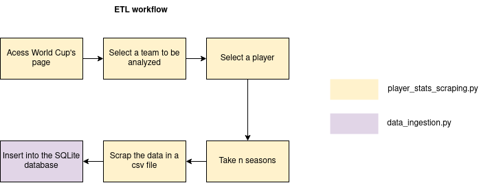

# ETL Soccer Player Stats

This project is an web scrapping code to extract soccer players' statistics from www.fbref.com .

## Index

- [1. ETL](#1-etl)

## 1. ETL

The first step of this analysis is to extract data from www.fbref.com through some libraries that allows web-scrapping. The following diagram shows the ETL flow:

Basically, the ETL will access the website in the World Cup's page, it will search by the Brazilian team and its players. Since we have this information, it is possible to access the player's page and the historical for different seasons. A for loop is implemented to get N seasons and also iterate for all the national team. Then, the dataset is saved in a csv file and a data ingestion is processed to move this file to a sqlite database.

Libraries that were used for this step are: 
1. Requests - allows page requests
2. Pandas - allows data manipulations
3. Sqlalchemy - allows connection with sqlite database
4. BeautifulSoup - allows extract information from a HTML page

After some scrapping, the description of each extracted feature are represented in the table below: 

### 1.1 Feature Description
| Feature | Description | 
| :---: | :---:   | 
| data | Match date |
| equipe |  Team analyzed |
| oponente |  Opponent team |
| jogador |  Player Name |
| num_camisa |  T-Shirt Number |
| nacao | Country of origin |
| pos | Player Position |
| idade |  Player age |
| min |  Minutes played in the match |
| desempenho_gols |  Goals in the match |
| desempenho_assis |Match assists |
| desempenho_pb |  Penalties taken |
| desempenho_pt | Penalties attempted |
| desempenho_tc |  Total Shots |
| desempenho_cag | Shots on goal |
| desempenho_crtsa | Yellow Cards |
| desempenho_crtv |  Red Card |
| desempenho_contatos |Number of times the player has touched the ball |
| desempenho_pressão |Number of times pressure was placed on the opponent |
| desempenho_div |  Number of tackles |
| desempenho_crts |  Number of tackles well done |
| desempenho_bloqueio | Number of times the ball was blocked |
| esperado_xg |  Expected goals |
| esperado_npxg |  Expected normal goals |
| esperado_xa | Expected number of assistances |
| sca_sca |  Kick creation actions |
| sca_gca | Goal creation actions |
| passes_cmp |  Completed passes |
| passes_att |  Attempted passes |
| passes_cmp_porc |  Percentage of correct passes |
| passes_progresso | Progressive passes (goal situation) |
| conduções_conduções |Number of times the player has dominated the ball with his foot |
| conduções_progresso |Driving to the opponent's area |
| dribles_succ | Successfully completed dribbling |
| dribles_att |  Tried dribbling |
| desempenho_fts | Fouls committed |
| desempenho_fltsp | Fouls suffered |
| desempenho_desativa |Number of offsides |
| desempenho_crz |  Number of crossings |
| desempenho_tklw |  Defenses that the opposing player keeps the ball |
| desempenho_og |  Own goals |
| desempenho_pênaltis |Penalties converted |
| desempenho_pkcon | Penalties suffered |
